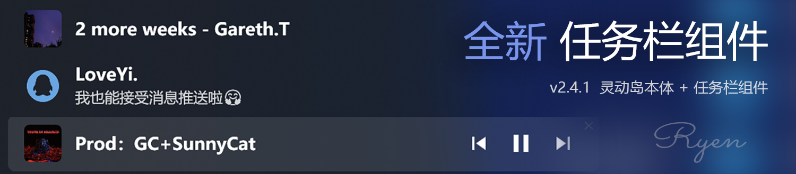

# NetSpeed Dynamic Pro (NSD)

<div align="center">


<h1>NetSpeed Dynamic Pro</h1>
<p>Dynamic Island for Windows</p>

[](https://tauri.app)
[](https://rust-lang.org)
[](https://vuejs.org)
[](https://www.typescriptlang.org)
[](https://vite.dev)
[](https://echarts.apache.org)

[简体中文](./README.md) &nbsp; | [English](./README.en.md) &nbsp; | [Download](https://github.com/GEORGEWWWU/NetSpeed-Dynamic/releases/latest) &nbsp; | [Website](https://nsd.georgewu.top/) &nbsp; | [QQ Group：1080730621](https://qm.qq.com/cgi-bin/qm/qr?k=i70z7rbl-VWpejQugvlXeARDUjwP7sIW&jump_from=webapi&authKey=b6Pj6zLuuCINDhafPJRttePdy3D45vvtWzcZ109LWoWYXkcKo8bNWI7fMhr+yV87)

</div>




---

NetSpeed Dynamic Pro (NSD) is a Windows desktop application built with Tauri 2, Rust, and Vue 3. It combines a floating Dynamic Island experience with a control console for real-time network monitoring, multi-platform music control, system notifications, and deep personalization.

## Highlights

- Monitor upload and download speeds in real time with traffic stats and trend charts
- Show network, music, messages, and system status in a floating Dynamic Island UI
- Support multi-platform media control through the Windows SMTC ecosystem
- Capture system notifications and present them more intuitively on screen
- Offer personalization options such as themes, opacity, size, corners, animations, and taskbar integration
- Support auto-start, system tray, taskbar pinning, and fullscreen game avoidance

## Core Features

### 1. Network Monitoring

- Refresh upload/download speed every second and switch units automatically
- Show network status indicators for normal, high latency, and disconnect states
- Provide local traffic statistics and monthly cumulative traffic stats
- Display built-in charts for recent traffic trends
- Reduce false disconnection detection during heavy traffic periods

### 2. Music and Media Control

- Control previous / play-pause / next through the Windows SMTC API
- Support NetEase Cloud Music, Spotify, Apple Music, QQ Music, Kugou Music, Echo Music, and LX Music
- Show song title, artist, and cover art in real time
- Prefer local cover art from the system media session with fallback sources
- Support lyrics display, lyric queue handling, and visual glow borders

### 3. Notifications and System Events

- Receive system Toast notifications and display them inside the Dynamic Island
- Support silent message mode, message priority queues, and click-to-open actions
- Observe volume changes, power plug/unplug, lock/unlock, and low battery events
- Provide dedicated icons and notification styles for different event types

### 4. Personalization Center

- Choose between Stiff and Bouncy spring animation styles
- Switch between black, white, and immersive themes
- Adjust corner shape, opacity, size, and global scaling
- Configure taskbar plugin behavior, lyric delay, position lock, and always-on-top options

## Tech Stack

| Layer | Technology |
|-------|------------|
| Desktop Framework | Tauri 2 (Rust) |
| Frontend Framework | Vue 3 + TypeScript |
| Build Tool | Vite 6 |
| Router | Vue Router 5 |
| Charts | ECharts 6 |
| Icons | Lucide Vue Next |
| Network Monitoring | sysinfo (Rust) |
| Async Runtime | Tokio (Rust) |
| HTTP Client | reqwest (Rust) |
| Media Control | Windows SMTC API |
| Audio Processing | cpal + rustfft |
| System Events | Windows COM / WinAPI |
| Storage | localStorage |

## Project Structure

```text
NetSpeed-Dynamic/
├── src/                      # Frontend source
│   ├── main.ts               # Application entry
│   ├── router/index.ts       # Router configuration
│   ├── i18n.ts               # Chinese/English localization
│   ├── views/
│   │   ├── MainPanel.vue     # Main console
│   │   └── WidgetIsland.vue  # Floating Dynamic Island
│   ├── components/
│   │   └── DynamicSet.vue    # Personalization center
│   └── assets/               # Icons, screenshots, and static assets
├── src-tauri/                # Tauri Rust backend
│   ├── src/
│   │   ├── lib.rs            # Core logic, windows, and animation
│   │   ├── music_controller.rs  # Media control and cover/lyric handling
│   │   ├── notification.rs   # System notification capture
│   │   ├── system_events.rs  # Volume, power, lock events
│   │   └── audio_spectrum.rs # Audio spectrum analysis
│   ├── Cargo.toml           # Rust dependencies
│   └── tauri.conf.json      # Tauri configuration
├── package.json              # Frontend dependencies and scripts
└── README.en.md             # English documentation
```

## Development Environment

### Prerequisites

- Windows 10/11
- Node.js 18+
- Rust 1.70+
- Tauri 2 CLI

### Install and Run

```bash
git clone https://github.com/GEORGEWWWU/NetSpeed-Dynamic.git
cd NetSpeed-Dynamic
npm install
npm run tauri dev
```

### Build for Release

```bash
npm run tauri build
```

The packaged output is written to `src-tauri/target/release/bundle/`.

## Usage

1. Launch the app to open the main console.
2. Turn on the Widget switch to show the floating Dynamic Island.
3. Drag it with the mouse and use the context menu for lock/reset/close actions.
4. Configure music platform selection, notification preferences, theme, opacity, and startup behavior.
5. Open the Personalization Center to adjust physics, appearance, size, and scaling.

> Note: This project is deeply adapted for Windows and relies on system SMTC, COM, and WinAPI features.

## License

MIT License

Copyright (c) 2026 Ryen (GEORGEWU)

## Support and Donation

If this project helps you, feel free to support the author:

| Method | Information |
|--------|-------------|
| WeChat Pay | [WeChat](./src/assets/wechat-pay.png) |
| Alipay | [Alipay](./src/assets/alipay.jpg) |
| GitHub Sponsors | [Support Here](https://github.com/sponsors/GEORGEWWWU) |

---

> Thank you to every supporter and user!