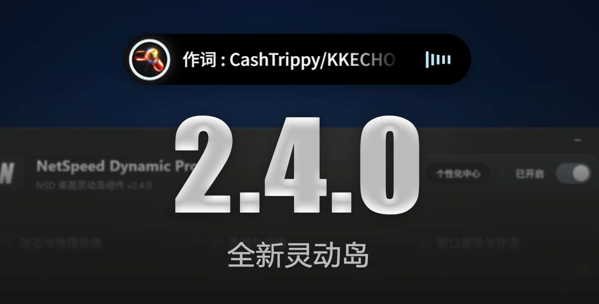

# NetSpeed Dynamic Pro (NSD)

<div align="center">


**NetSpeed Dynamic Pro** —— 专为 Windows 而生的灵动岛

[](https://tauri.app)
[](https://rust-lang.org)
[](https://vuejs.org)
[](https://www.typescriptlang.org)
[](https://vite.dev)
[](https://echarts.apache.org)

[简体中文](./README.md) &nbsp; | [English](./README.en.md) &nbsp; | [下载地址](https://github.com/GEORGEWWWU/NetSpeed-Dynamic/releases/latest) &nbsp; | [官方网站](https://nsd.georgewu.top/)

</div>




---

这是一个基于 **Tauri 2 + Rust + Vue 3** 的桌面灵动岛组件，灵动岛悬浮窗实时显示网络速度，支持多平台音乐控制、流量统计、系统通知接收、系统事件监控，支持置于任务栏左下角。

## 功能

### 网速监控

- **实时网速**：每秒刷新上传/下载速度，自动切换单位
- **灵动岛悬浮窗**：支持拖拽移动、弹簧动画进出场
- **网络状态指示灯**：绿色（正常）/黄色（高延迟）/红色（断网）
- **流量高亮**：超过 1MB/s 时箭头自动高亮提醒
- **速度趋势图表**：控制台内置迷你折线图展示最近 15 秒下载速度
- **本地流量统计**：自动记录每日上传/下载数据，支持柱状图/折线图可视化
- **本月流量统计**：实时计算本月累计使用流量
- **智能断网判定**：大流量状态下避免误判断网，5秒缓冲期后才判定真正断网

### 多平台音乐控制

- **播放控制**：上一首 / 播放暂停 / 下一首（通过系统 SMTC API）
- **多平台支持**：网易云音乐、Spotify、Apple Music、QQ音乐、酷狗音乐、Echo Music、洛雪音乐(LX Music)
- **歌曲信息**：实时显示歌名、歌手和专辑封面
- **封面旋转**：播放时封面自动旋转，暂停时停止
- **多源封面获取**：优先从系统 SMTC 提取本地高清封面，降级至网易云、Deezer、Apple Music，SVG 渐变兜底
- **封面缓存**：智能缓存最近 50 首歌曲封面，提升响应速度
- **本地封面提取**：通过 SMTC API 直接获取应用内本地高清封面
- **彩虹流光边框**：8 色渐变旋转边框，可独立开关
- **音频频谱可视化**：实时捕获系统音频输出，通过 FFT 变换生成 5 频段律动频谱，跟随音乐节奏跳动
- **歌名滚动**：长歌名自动水平滚动，展开后切换为双行显示
- **智能交互**：悬停显示控件，离开后自动切换为歌曲信息，1秒自动收缩
- **歌词显示**：LRC 歌词实时同步显示，LRCLIB API 优先获取，网易云 API 兜底
- **歌词防吞字**：智能队列控制，确保歌词稳定展示至少 2.8 秒

### 系统消息通知

- **实时捕获**：接收系统 Toast 通知并在灵动岛展示
- **动态扩展**：收到通知时灵动岛自动放大展示应用图标、标题和内容
- **智能过滤**：自动过滤微信通知避免干扰
- **点击唤醒**：点击通知区域直接打开对应应用（支持 QQ、微信、钉钉等）
- **静默消息模式**：平时自动隐藏，收到消息后才弹出
- **通知队列优先级**：消息通知最高优先级，系统通知优先于操作通知

### 系统事件监控

- **音量变化检测**：实时监听系统音量变化，自动弹出通知
- **电源状态监控**：检测电源插入/拔出状态，显示充电状态图标
- **低电量警告**：电量低于 20% 时自动触发红色警告通知（20%/15%/10%/5% 关键节点）
- **专用SVG图标**：充电/低电量/锁定/解锁各有独立图标
- **锁定/解锁通知**：桌面锁定/解锁时触发专属图标通知

### 个性化中心

- **物理动效切换**：Stiff（快速精准）/ Bouncy（Q弹欢快）两种弹簧动画风格
- **外观与边缘**：
  - 颜色切换：黑色/白色背景色调
  - 边缘形态：经典胶囊（圆角100px）/圆角矩形（圆角12px）
- **窗口层级**：始终置顶选项
- **尺寸边界空间**：
  - 常规宽度：140px ~ 300px
  - 全局高度基准：30px ~ 60px
  - 媒体控制器常态宽度：200px ~ 400px
  - 媒体控制器展开宽度：260px ~ 480px
  - 消息弹窗宽度：300px ~ 600px
- **全局缩放**：100% ~ 175% DPI 调整

### 设置与系统集成

- **主题切换**：浅色/深色/沉浸模式/跟随系统
- **沉浸模式**：控制台背景随当前播放歌曲封面模糊变化
- **灵动岛颜色**：支持黑色/白色背景色调切换
- **透明度调节**：0%~100% 实时同步至悬浮窗
- **开机自启**：跟随系统启动，静默启动时主窗口隐藏
- **系统托盘**：左键唤起控制台，右键强制退出
- **置于任务栏**：锁定至屏幕左下角，禁止拖拽，自动置顶
- **位置锁定**：右键菜单可锁定/解锁灵动岛位置
- **全屏游戏避让**：自动检测全屏窗口，避免抢占焦点（排除系统外壳组件）
- **检查更新**：静默检测新版本并提示下载，支持 10 秒超时保护

## 技术栈

| 层级 | 技术 |
|------|------|
| 桌面框架 | Tauri 2 (Rust) |
| 前端框架 | Vue 3 + TypeScript |
| 构建工具 | Vite 6 |
| 路由 | Vue Router 5 |
| 图表 | ECharts 6 |
| 图标 | Lucide Vue Next |
| 网络监控 | sysinfo (Rust) |
| 异步运行时 | Tokio (Rust) |
| HTTP 客户端 | reqwest (Rust) |
| 媒体控制 | Windows SMTC API |
| 音频捕获 | cpal (Rust) |
| 频谱分析 | rustfft (Rust) |
| 系统事件 | Windows COM API |
| Windows API | windows-sys + winapi |
| 本地存储 | localStorage |

## 项目结构

```
NetSpeed-Dynamic/
├── src/                    # 前端源码
│   ├── main.ts             # 应用入口
│   ├── router/index.ts     # 路由配置
│   ├── i18n.ts             # 国际化配置（中文/英文）
│   ├── views/
│   │   ├── MainPanel.vue   # 主控制台（设置、统计、音乐平台切换）
│   │   └── WidgetIsland.vue # 灵动岛悬浮窗（网速、音乐、消息、硬件、频谱）
│   ├── components/
│   │   └── DynamicSet.vue  # 个性化中心（物理动效、外观、尺寸设置）
│   └── assets/             # 静态资源（图标、截图）
├── src-tauri/              # Tauri 后端
│   ├── src/
│   │   ├── main.rs         # Rust 入口
│   │   ├── lib.rs          # 核心逻辑（网络、动画、窗口管理）
│   │   ├── audio_spectrum.rs # 音频频谱分析（FFT）
│   │   ├── music_controller.rs # 音乐控制器（SMTC API、歌词获取）
│   │   ├── notification.rs # 系统通知捕获
│   │   └── system_events.rs # 系统事件监控（音量、电源）
│   ├── Cargo.toml          # Rust 依赖
│   └── tauri.conf.json     # Tauri 配置
└── package.json            # 前端依赖
```

## 开发环境

### 前置依赖

- Node.js >= 18
- Rust >= 1.70
- Tauri 2 CLI

### 安装与运行

```bash
git clone https://github.com/GEORGEWWWU/NetSpeed-Dynamic.git
cd NetSpeed-Dynamic
npm install
npm run tauri dev
```

### 构建发布

```bash
npm run tauri build
```

产物位于 `src-tauri/target/release/bundle/`。

## 使用方式

1. 启动后显示主控制台，点击系统托盘可随时唤起
2. 开启 Widget 开关，屏幕顶部出现灵动岛悬浮窗
3. 左键拖拽移动，右键菜单可重置位置、锁定位置、开关流光边框或关闭
4. 在"灵动岛设置"中选择音乐平台、开启音乐控制、消息通知
5. 在"灵动岛设置"中切换灵动岛颜色（亮色/暗色）和开启静默消息模式
6. 控制台右侧可切换常规设置与数据统计面板，支持柱状图/折线图切换
7. 点击"个性化中心"进入高级设置，调整物理动效、外观、尺寸等参数

## 开源协议

MIT License

Copyright (c) 2026 Ryen (GEORGEWU)

## 捐赠

如果 NSD 对你有帮助，欢迎请作者喝杯咖啡！

| 方式 | 信息 |
|------|------|
| 微信支付 | [微信](./src/assets/wechat-pay.png) |
| 支付宝 | [支付宝](./src/assets/alipay.jpg) |
| GitHub Sponsors | [前往支持](https://github.com/sponsors/GEORGEWWWU) |

---

> 感谢每一位支持者！